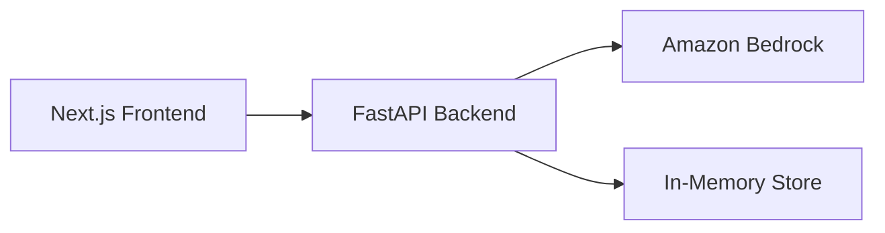

# Spec-Driven Development

Guide the user through three phases to produce a complete, buildable specification. Each phase generates a document, asks for approval, and only proceeds when the user confirms.

## Overview

```
Phase 1: Requirements → Phase 2: Design → Phase 3: Tasks
```

- Phase 1 produces `requirements.md` (what to build)
- Phase 2 produces `design.md` (how to build it)
- Phase 3 produces `tasks.md` (step-by-step implementation plan)

All files are saved to a `specs/{feature-name}/` directory in the project root.

## Critical Rules

1. **Generate first, ask questions later.** Don't interview the user endlessly. Produce a draft document as a starting point, then iterate based on feedback.
2. **One phase at a time.** Complete and get approval for each phase before moving to the next.
3. **Approval is explicit.** Look for "yes", "looks good", "approved", "move on", "continue". Any other feedback means revise and ask again.
4. **Stay within hackathon constraints.** Everything runs locally. Only Bedrock API calls. Frontend: Next.js + Tailwind + shadcn/ui. Backend: FastAPI with in-memory storage.

---

## Phase 1: Requirements

Generate a requirements document using EARS (Easy Approach to Requirements Syntax).

### Process

1. Take the user's feature idea (from conversation or their prompt)
2. Derive a feature name in kebab-case (e.g., `product-recommendation`)
3. Create `specs/{feature-name}/requirements.md` with:
   - **Introduction**: 2-3 sentences describing what the feature does
   - **Glossary**: 3-10 domain terms used in the requirements
   - **Requirements**: 3-7 user stories, each with EARS acceptance criteria

### EARS Patterns (mandatory for all acceptance criteria)

- **Event-driven**: WHEN [trigger], THE [system] SHALL [action]
- **State-driven**: WHILE [state], THE [system] SHALL [action]
- **Unwanted behavior**: IF [condition], THEN THE [system] SHALL [action]
- **Optional**: WHERE [feature is enabled], THE [system] SHALL [action]

### Example Requirement

```markdown
### Requirement 1

**User Story:** As a user, I want to submit a query and see AI-generated results, so that I can get intelligent recommendations.

#### Acceptance Criteria

1. WHEN a user submits a text query, THE System SHALL send it to Amazon Bedrock for analysis and return structured JSON within 30 seconds
2. WHEN analysis is complete, THE System SHALL display the results in a readable format
3. IF the input exceeds the maximum length, THEN THE System SHALL truncate it before processing
```

### After generating

Say: "Do the requirements look good? If so, we can move on to the design."

---

## Phase 2: Design

Generate a technical design document based on approved requirements.

### Process

1. Read the approved `requirements.md`
2. Research the existing codebase if any code exists:
   - Identify existing patterns and conventions
   - Check for similar implementations to reference
3. Generate `specs/{feature-name}/design.md` with:
   - **Overview**: Solution approach and key technical decisions (3-5 sentences)
   - **Architecture**: Mermaid diagram showing component relationships and data flow
   - **Architectural Principles**: 2-4 bullet points on key design decisions
   - **Components**: Major modules with their responsibilities
   - **Interfaces**: Key function/API signatures (TypeScript-like syntax)
   - **Data Models**: JSON/TypeScript interfaces with validation rules per field
   - **Error Handling**: Error types, conditions, and recovery strategies
   - **Testing Strategy**: What to test and how (unit + integration)

### Design MUST Address ALL Requirements

- Every requirement from Phase 1 must be covered in the design
- Trace design decisions back to specific requirements
- If a requirement cannot be addressed, flag it and discuss with the user

### Architecture Diagram (required)

Use Mermaid syntax. Example:



### Design Constraints (always apply)

- Frontend: Next.js + Tailwind CSS + shadcn/ui (single page.tsx with view state)
- Backend: FastAPI single main.py, in-memory storage (Python dicts/lists)
- AWS: `boto3.Session(profile_name='ilm-hackathon')`, Bedrock model `us.anthropic.claude-sonnet-4-20250514`
- CORS: Backend allows http://localhost:3000
- Images: Resize to max 1500px width before sending to Bedrock

### After generating

Say: "Does the design look good? If so, we can move on to the implementation plan."

---

## Phase 3: Tasks

Generate an implementation plan as a numbered task list.

### Process

1. Read both `requirements.md` and `design.md`
2. Generate `specs/{feature-name}/tasks.md` with:
   - Numbered checkbox tasks (`- [ ] 1. ...`)
   - Sub-tasks where needed (`- [ ] 1.1 ...`, max 2 levels)
   - Requirement references on each task (`_Requirements: 1, 2_`)
   - Checkpoint tasks every 2-3 implementation tasks

### Task Rules

- **Coding tasks only**: Write, modify, or test code. No deployment, documentation, or manual testing.
- **Incremental**: Each task builds on the previous. No orphaned code.
- **Checkpoints are blocking**: Format `- [ ] X. Checkpoint - Verify all tests pass`. Not optional. Do NOT mark with `*`.
- **Optional tasks**: Mark with `*` (e.g., `- [ ]* 5. Add loading animations`)
- **Parent tasks**: If a task has sub-tasks, it's a group header. Mark complete only when all sub-tasks done.
- **Task status**: `- [ ]` for pending, `- [x]` for done.
- **Requirement traceability**: Every task references requirements (`_Requirements: 1, 2_`). Every requirement must be covered by at least one task.

### Numbering Rules

- Top-level tasks: `1.`, `2.`, `3.`
- Sub-tasks: `2.1`, `2.2`, `2.3`
- Maximum 2 levels (no `2.1.1`)
- Parent tasks with sub-tasks are GROUP HEADERS (not directly executed)
- Tasks without sub-tasks are directly executable
- Use sub-tasks when a feature has 3+ related implementation steps

### Task Types to Include

- Set up project structure (backend/, frontend/)
- Create data models and interfaces
- Implement API endpoints
- Implement frontend views
- Wire frontend to backend
- Add error handling
- Checkpoint tasks (run and verify)

### Task Types to Exclude

- Deployment to any environment
- User acceptance testing
- Performance benchmarking
- Documentation writing
- Manual testing steps

### After generating

Say:

```
The spec is complete! You now have:
- requirements.md - What to build
- design.md - How to build it  
- tasks.md - Step-by-step implementation plan

You can start building by asking me to execute the first task, or run /01-start-development to build the MVP.
```

---

## Phase Transitions

- If during Design the user identifies missing requirements → go back to Phase 1, update, get approval, return
- If during Tasks the user identifies design gaps → go back to Phase 2, update, get approval, return
- After Tasks approval → workflow complete, user can start building

## Handling User Shortcuts

If the user says something like "just give me the tasks" or "skip to implementation":
- Explain briefly that requirements and design help the AI build better code
- But respect their choice - generate a minimal requirements + design inline, then produce tasks
- Don't force the full ceremony if they don't want it
