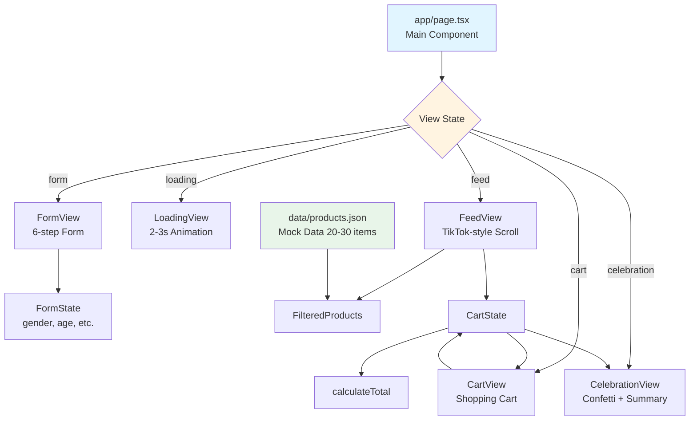

# Design: FTC Gift Finder

## Overview

FTC Gift Finder ใช้สถาปัตยกรรม Client-Side Single Page Application (SPA) ที่ทำงานบน Next.js 16 App Router โดยใช้ React Client Component เพียงไฟล์เดียว (`app/page.tsx`) ควบคุมทุกหน้าจอผ่าน State Machine pattern ข้อมูลสินค้า (Mock Data) โหลดจากไฟล์ JSON ในฝั่ง Client โดยไม่มี Backend API State Management ใช้ React useState และ useEffect สำหรับ Cart และ Form Data UI ออกแบบแบบ Mobile-First โดยใช้ Tailwind CSS 4.x สำหรับ Animation ใช้ CSS Transitions และ canvas-confetti library สำหรับหน้า Celebration

## Architecture



## Architectural Principles

- **Single Component Architecture**: ทุกหน้าจออยู่ใน `app/page.tsx` เดียว ควบคุมด้วย View State (`'form' | 'loading' | 'feed' | 'cart' | 'celebration'`) เพื่อลดความซับซ้อนและเวลาในการพัฒนา
- **Client-Side Only**: ไม่มี Server Components, API Routes, หรือ Database เพื่อให้สามารถสร้างต้นแบบได้เร็วภายในเวลา 4-5 ชั่วโมง
- **Tag-Based Filtering**: สินค้ากรองด้วย Simple Matching Algorithm ที่เช็ค Tags ว่าตรงกับคำตอบจากแบบฟอร์มหรือไม่ (ไม่ใช้ AI/ML)
- **Mobile-First Responsive**: ออกแบบเพื่อหน้าจอ 375px (iPhone) ก่อน Desktop Simulation จะแสดงเป็น Fixed Width Container

## Components

### 1. Main Component (`app/page.tsx`)

**ความรับผิดชอบ:**
- จัดการ View State (form → loading → feed → cart → celebration)
- เก็บ Form Answers, Cart Items, Filtered Products
- Orchestrate การเปลี่ยนหน้าจอตาม User Actions

**State Variables:**
```typescript
const [view, setView] = useState<'form' | 'loading' | 'feed' | 'cart' | 'celebration'>('form')
const [formStep, setFormStep] = useState<number>(1) // 1-6
const [formData, setFormData] = useState<FormData>({ gender: '', age: '', relationship: '', occasion: '', budget: '', style: '' })
const [cart, setCart] = useState<CartItem[]>([])
const [products, setProducts] = useState<Product[]>([])
const [filteredProducts, setFilteredProducts] = useState<Product[]>([])
```

### 2. FormView Sub-Component

**ความรับผิดชอบ:**
- แสดงคำถามตาม `formStep` (1-6)
- แสดง Progress Bar (formStep/6)
- บันทึกคำตอบใน `formData`
- เมื่อครบ 6 ข้อ → `setView('loading')`

**Questions:**
1. เพศ: ผู้ชาย, ผู้หญิง, ยูนิเซ็กซ์
2. อายุ: เด็ก, วัยรุ่น, ผู้ใหญ่, ผู้สูงอายุ
3. ความสัมพันธ์: แฟน, เพื่อน, ครอบครัว, เพื่อนร่วมงาน
4. โอกาส: วันเกิด, วันวาเลนไทน์, ปีใหม่, ขอบคุณ
5. งบประมาณ: <200, 200-500, 500-1000, >1000 บาท
6. สไตล์: น่ารัก, แปลก, มินิมอล, สนุกสนาน

### 3. LoadingView Sub-Component

**ความรับผิดชอบ:**
- แสดง Loading Animation (Spinner + Text "กำลังค้นหาของขวัญ...")
- ใช้ `useEffect` กรองสินค้าตาม `formData`
- หลัง 2-3 วินาที → `setView('feed')`

### 4. FeedView Sub-Component

**ความรับผิดชอบ:**
- แสดง `filteredProducts` ทีละรายการแบบเต็มหน้าจอ
- ใช้ CSS `snap-y snap-mandatory` สำหรับ Vertical Snap Scroll
- แสดง Cart Badge (จำนวนสินค้าในตะกร้า) มุมบนขวา
- ปุ่ม "เพิ่มลงตะกร้า" → เพิ่มใน `cart`
- กด Cart Badge → `setView('cart')`

**Product Card Layout:**
```
┌──────────────────┐
│   รูปภาพสินค้า    │ ← Full-width image
├──────────────────┤
│ ชื่อสินค้า (Thai) │ ← Text-lg font-bold
│ ฿299             │ ← Text-xl text-primary
│ [เพิ่มลงตะกร้า]   │ ← Button
└──────────────────┘
```

### 5. CartView Sub-Component

**ความรับผิดชอบ:**
- แสดงรายการสินค้าใน `cart` พร้อม +/- buttons
- แสดงราคารวม (sum of quantity × price)
- Text Area สำหรับ Gift Message
- ปุ่ม "ชำระเงิน" → `setView('celebration')`
- ปุ่ม "กลับไปเลือกสินค้า" → `setView('feed')`

### 6. CelebrationView Sub-Component

**ความรับผิดชอบ:**
- เล่น Confetti Animation (canvas-confetti library)
- แสดงข้อความ "สั่งซื้อสำเร็จ! 🎉"
- แสดงสรุปรายการสินค้า + ราคารวม
- ปุ่ม "กลับหน้าแรก" → รีเซ็ตทุก State → `setView('form')`

## Interfaces

### Product Data Model

```typescript
interface Product {
  id: string
  name: string // ภาษาไทย
  price: number // THB
  image: string // URL or /images/product-xx.jpg
  tags: {
    gender: 'male' | 'female' | 'unisex'
    age: 'child' | 'teen' | 'adult' | 'senior'
    relationship: 'partner' | 'friend' | 'family' | 'colleague'
    occasion: 'birthday' | 'valentine' | 'newyear' | 'thankyou'
    budget: '<200' | '200-500' | '500-1000' | '>1000'
    style: 'cute' | 'quirky' | 'minimal' | 'fun'
  }
}
```

**Validation Rules:**
- `id`: Required, unique string
- `name`: Required, Thai text, 10-100 characters
- `price`: Required, positive number
- `image`: Required, valid URL or relative path
- `tags`: All fields required, must match enum values

### Form Data Model

```typescript
interface FormData {
  gender: 'male' | 'female' | 'unisex' | ''
  age: 'child' | 'teen' | 'adult' | 'senior' | ''
  relationship: 'partner' | 'friend' | 'family' | 'colleague' | ''
  occasion: 'birthday' | 'valentine' | 'newyear' | 'thankyou' | ''
  budget: '<200' | '200-500' | '500-1000' | '>1000' | ''
  style: 'cute' | 'quirky' | 'minimal' | 'fun' | ''
}
```

**Validation Rules:**
- All fields initially empty string (`''`)
- Each field required before moving to next step
- Form complete when all 6 fields have non-empty values

### Cart Item Model

```typescript
interface CartItem {
  product: Product
  quantity: number // >= 1
}
```

**Business Rules:**
- `quantity` must be >= 1
- If quantity set to 0 → remove from cart
- Cart badge shows total count (sum of all quantities)

## Key Functions

### filterProducts

```typescript
function filterProducts(products: Product[], formData: FormData): Product[] {
  // Filters products where ALL tags match formData
  // If no exact matches, returns products with most matching tags (>= 3)
  // Minimum return: 5 products (or all if < 5 available)
}
```

**Logic:**
1. Score each product: +1 for each matching tag
2. Sort by score descending
3. If any product has score === 6 (perfect match), return those
4. Else return products with score >= 3, minimum 5 items

### calculateTotal

```typescript
function calculateTotal(cart: CartItem[]): number {
  return cart.reduce((sum, item) => sum + (item.product.price * item.quantity), 0)
}
```

### addToCart

```typescript
function addToCart(product: Product, cart: CartItem[], setCart: Function): void {
  const existing = cart.find(item => item.product.id === product.id)
  if (existing) {
    setCart(cart.map(item => 
      item.product.id === product.id 
        ? { ...item, quantity: item.quantity + 1 } 
        : item
    ))
  } else {
    setCart([...cart, { product, quantity: 1 }])
  }
}
```

### updateQuantity

```typescript
function updateQuantity(productId: string, delta: number, cart: CartItem[], setCart: Function): void {
  setCart(cart
    .map(item => 
      item.product.id === productId 
        ? { ...item, quantity: item.quantity + delta } 
        : item
    )
    .filter(item => item.quantity > 0)
  )
}
```

## Data Models

### products.json Structure

```json
[
  {
    "id": "ftc-001",
    "name": "ตุ๊กตายูนิคอร์นสีพาสเทล",
    "price": 299,
    "image": "/images/unicorn-plush.jpg",
    "tags": {
      "gender": "female",
      "age": "teen",
      "relationship": "friend",
      "occasion": "birthday",
      "budget": "200-500",
      "style": "cute"
    }
  },
  ...
]
```

**Constraints:**
- Array length: 20-30 items
- All products must have complete tag set
- Images can be placeholder URLs (e.g., `https://placehold.co/400x400/pink/white?text=Product+1`)

## Error Handling

### Client-Side Errors

| Error Condition | Detection | User Feedback | Recovery |
|----------------|-----------|---------------|----------|
| products.json load failure | `fetch` error in `useEffect` | Alert "ไม่สามารถโหลดข้อมูลสินค้าได้" | Retry button → reload page |
| Invalid product data | Missing required fields | Console warn, skip product | Continue with valid products |
| Empty filtered results | `filteredProducts.length === 0` | Show "ไม่พบสินค้าที่เหมาะสม" + button "เลือกใหม่" → reset form | User restarts selection |
| Image load failure | `<Image>` onError | Show placeholder gray box with "📦" emoji | Continue showing product |

**No Error Boundaries**: Simple try-catch in async functions only. Page reload is acceptable recovery.

## Testing Strategy

### Manual Testing Checklist

**Form Flow:**
- [ ] Progress bar updates on each step (1/6 → 6/6)
- [ ] Can't proceed without selecting an option
- [ ] Form data persists across all 6 steps
- [ ] Clicking "ถัดไป" on step 6 triggers loading

**Product Feed:**
- [ ] Shows filtered products after loading
- [ ] Vertical snap scroll works smoothly
- [ ] "เพิ่มลงตะกร้า" updates cart badge number
- [ ] Cart badge clickable → opens cart view

**Shopping Cart:**
- [ ] All cart items display with correct name, price, quantity
- [ ] +/- buttons update quantity and total immediately
- [ ] Setting quantity to 0 removes item
- [ ] Gift message textarea accepts Thai text
- [ ] "ชำระเงิน" button works

**Celebration:**
- [ ] Confetti animation plays automatically
- [ ] Shows "สั่งซื้อสำเร็จ!" message
- [ ] Displays order summary with correct total
- [ ] "กลับหน้าแรก" resets app to form step 1

**Mobile Responsiveness:**
- [ ] Test on 375px viewport (iPhone)
- [ ] All text readable without zoom
- [ ] Touch targets >= 44px
- [ ] Snap scroll snaps to center of screen

### Integration Testing

**Test Scenario 1: Complete Happy Path**
1. Fill form with all 6 questions
2. Wait for loading (2-3s)
3. Scroll through feed, add 3 products
4. Open cart, adjust quantities (+/-)
5. Write gift message
6. Checkout → see celebration
7. Return to home → form reset

**Expected:** No errors, smooth transitions, correct totals

**Test Scenario 2: Edge Cases**
1. Fill form with rare combination (e.g., senior + quirky)
2. Verify at least 5 products shown (partial match)
3. Add 10x of same product
4. Remove all items from cart
5. Try checkout with empty cart

**Expected:** Graceful handling, button disabled if cart empty

## Requirements Coverage

- ✅ **Requirement 1**: FormView handles 6-step form with progress bar
- ✅ **Requirement 2**: LoadingView + FeedView handle product recommendation feed
- ✅ **Requirement 3**: CartView handles shopping cart management
- ✅ **Requirement 4**: CelebrationView handles checkout celebration
- ✅ **Requirement 5**: products.json provides mock data
- ✅ **Requirement 6**: Mobile-first Tailwind CSS + Snap Scroll

All requirements fully addressed in design.
